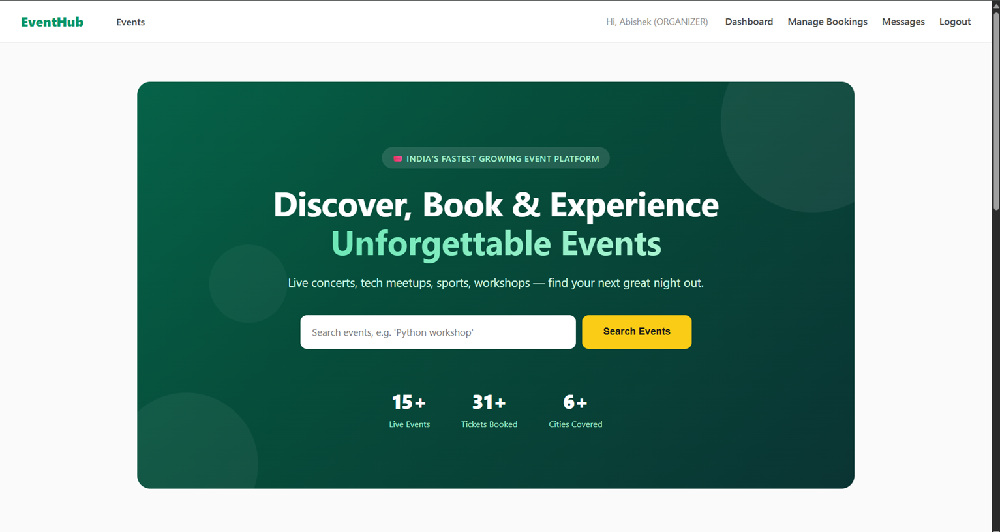
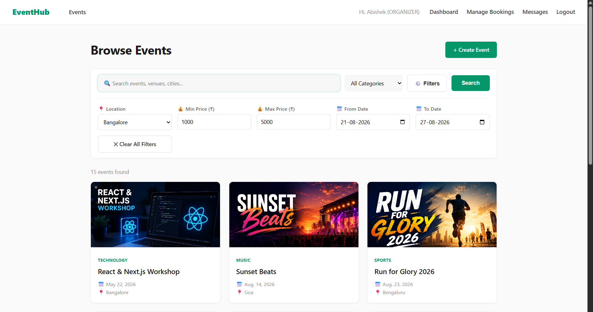
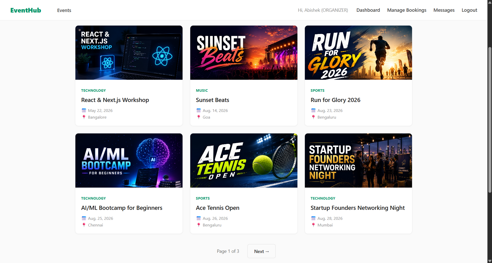
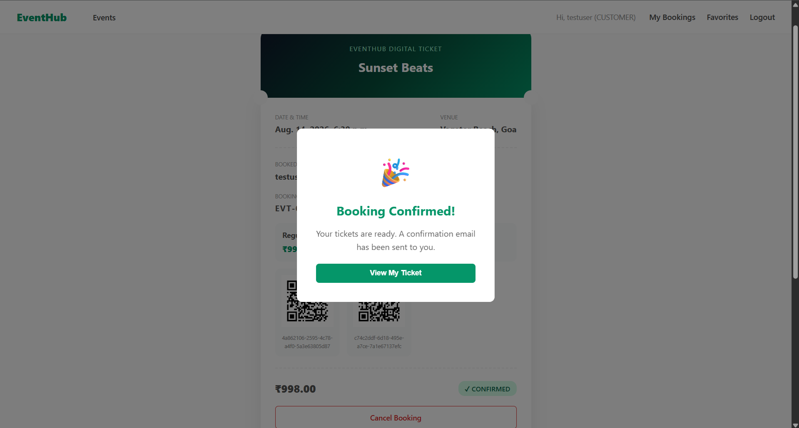
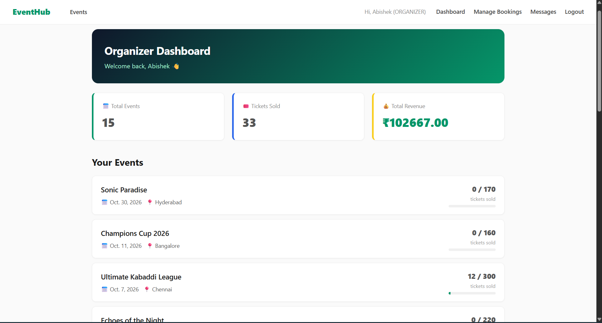
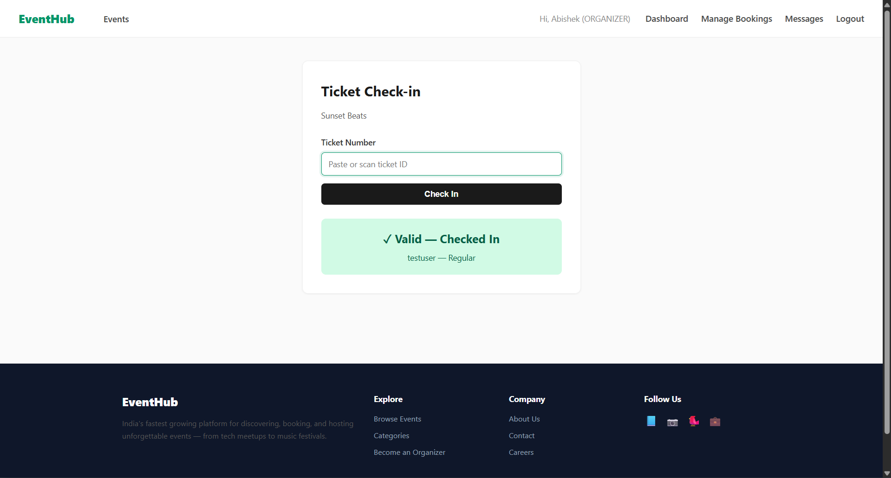
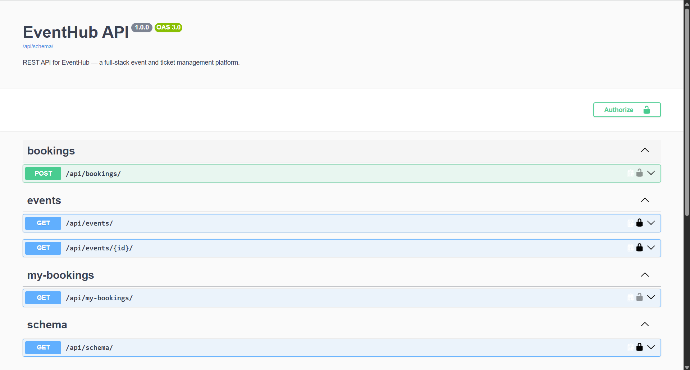

# 🎟️ EventHub — Full-Stack Event & Ticket Management Platform

EventHub is a complete event discovery, booking, and management platform built with Django and MySQL. It goes beyond a basic CRUD app — implementing real-world business logic like race-condition-safe ticket booking, QR-code check-in, refund tracking, and a fully documented REST API.

## 🌟 Live Features

### For Customers
- Browse, search (with live autocomplete), and filter events by category, location, price, and date
- Book tickets with real-time availability checking
- Receive digital tickets with unique QR codes per ticket
- Cancel bookings (up to 24 hours before the event) with automatic refund tracking
- Leave ratings & reviews after attending an event
- Save events to a personal Favorites list
- Get personalized event recommendations based on booking/favorite history

### For Organizers
- Create, edit, and delete events with an image gallery
- Configure multiple ticket types with independent pricing and inventory
- Live dashboard with revenue, tickets sold, and per-event breakdowns
- Manage all bookings across events, including processing refunds
- Scan and check in attendees via QR code, with duplicate-scan protection

### Platform-Wide
- Role-based authentication (Customer / Organizer / Admin)
- Fully documented REST API with interactive Swagger docs
- Email notifications on booking confirmation
- Responsive, animated, professional UI

## 📸 Screenshots

| Browse Events | Event Details |
|---|---|
|  |  |

| Digital Ticket | Organizer Dashboard |
|---|---|
|  |  |

| Check-in Scanner | REST API Docs |
|---|---|
|  |  |

## 🛠️ Tech Stack

- **Backend:** Django 5.2, Python
- **Database:** MySQL
- **API:** Django REST Framework + drf-spectacular (Swagger/OpenAPI docs)
- **Frontend:** Django Templates, vanilla JavaScript (live search, toast notifications)
- **Other:** Pillow (image handling), qrcode (ticket QR generation)

## 🏗️ Architecture Highlights

- **Race-condition-safe booking** — uses `select_for_update()` and database transactions to prevent overselling tickets, even under concurrent requests
- **Role-based permissions** — enforced at the view level for every organizer-only and customer-only action
- **RESTful API** — separate lightweight/detailed serializers, authenticated write endpoints, auto-generated OpenAPI docs
- **Business rule enforcement** — reviews require a confirmed booking + elapsed event date; cancellations respect a 24-hour cutoff; refunds are tracked as a distinct workflow from cancellation

## 📂 Project Structure